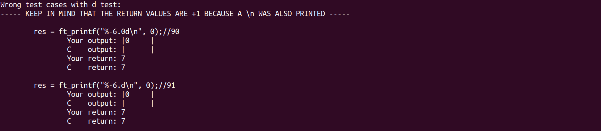

# Printf_tester


[](https://opensource.org/licenses/MIT)



**Don't use this tester while writing your code. To be a good programmer, you should write your own tests. This tester is intended as a last check for your project, to see whether you missed some testcases.**

## :rocket: Description

:warning:This is a tester for the ft_printf project in 42's curriculum. It contains 800+ tests and is made with the user in mind. It is very easy to use after a small setup. It is also very easy to see which test cases you failed (see figure above).

It only tests for:<br>
1. "cspdiuxX%" conversions.
2. "0-" flags.
3. Width and precision (also with the '*' option).

**The output of printf on Linux and MacOS is different. Be aware of this. Make sure you test it on the iMacs! Below you can find some cases (not all) in which Linux and MacOS differ:**
```C
Precision used with s-conversion with NULL as input: printf("%.2s", NULL);
Width used with %-conversion: printf("%3%");
NULL as input with p-conversion: printf("%p", NULL);
```

## :gear: Installation and Setup

Clone this repository and go inside the project folder. Create a new directory called "src".

```sh
mkdir src
```

Copy your ft_printf project files into the src/ directory. Now open the printf_tester.sh file and put the absolute path to your headerfile in line 4. For me it was something like:

```sh
HEADER_PATH="/home/hilmi/curriculum/printf_tester/src"
```

**Make sure your headerfile is called ft_printf.h**.

## :joystick: Usage

To run the tester, simply run:

```sh
./printf_tester.sh
```

In the **logs/wrong_test_cases** file you can find all the testcases for which your project failed.

## :mailbox: Contribute

Found a bug? Ran into a specific problem? Missing a feature? Or you have some more testcases? Feel free to **file a new issue** with a respective title and description on the [issue page](https://github.com/hilmi-yilmaz/printf_tester/issues). You can also ask questions in [GitHub Discussion](https://github.com/hilmi-yilmaz/printf_tester/discussions). 

## :blue_book: License
[MIT](https://opensource.org/licenses/MIT)
